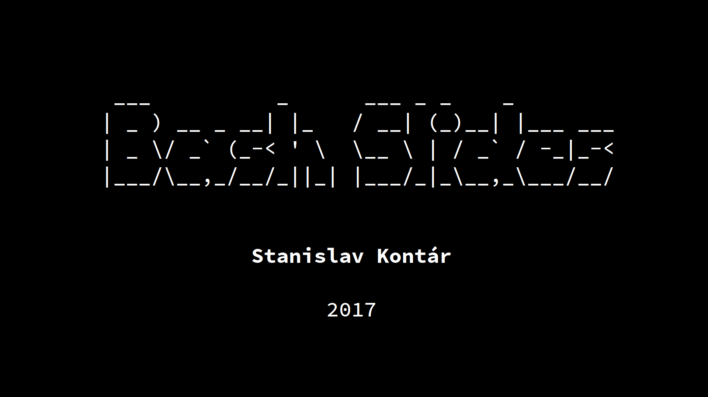
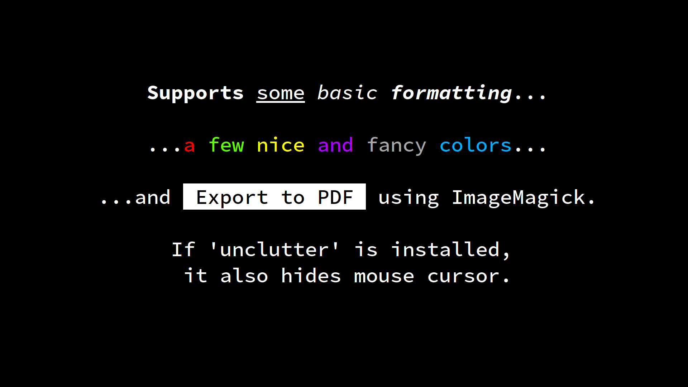
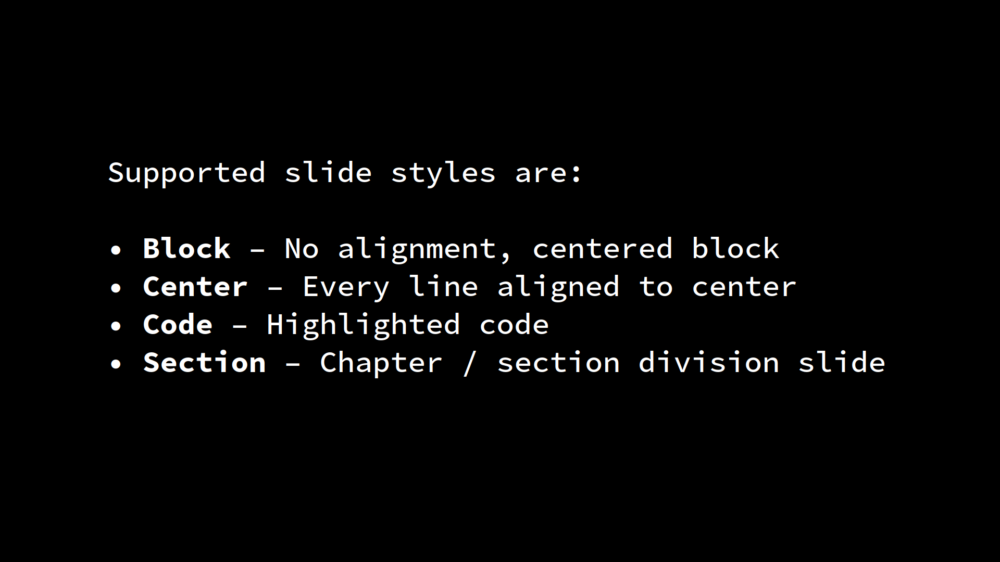
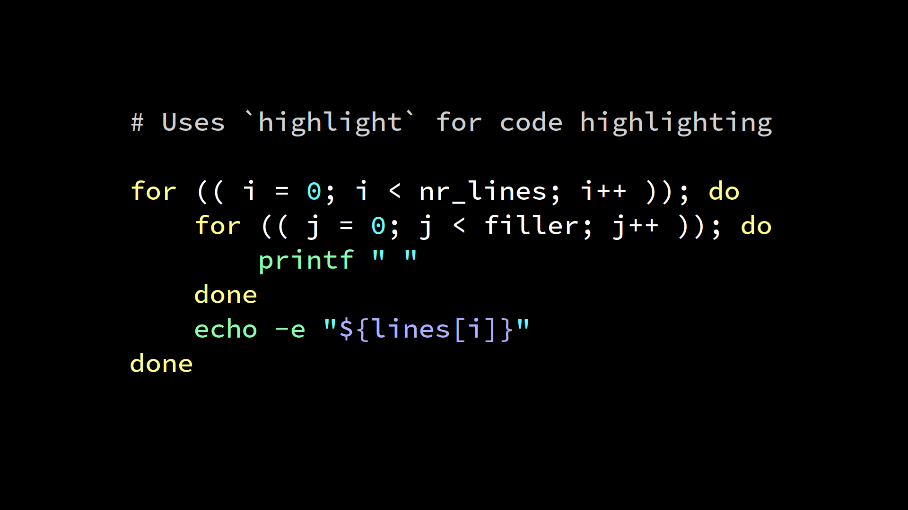
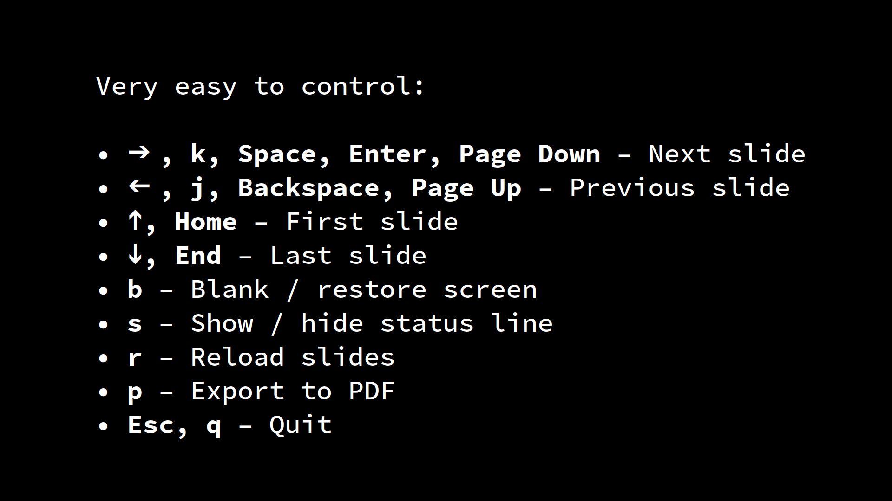
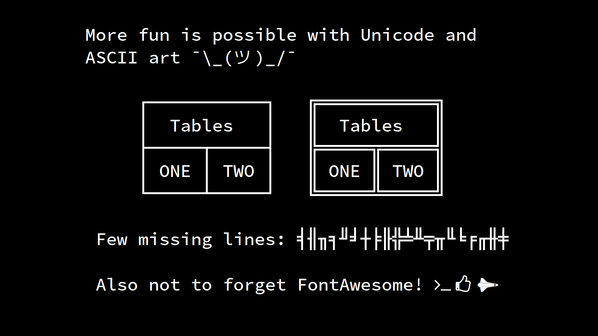
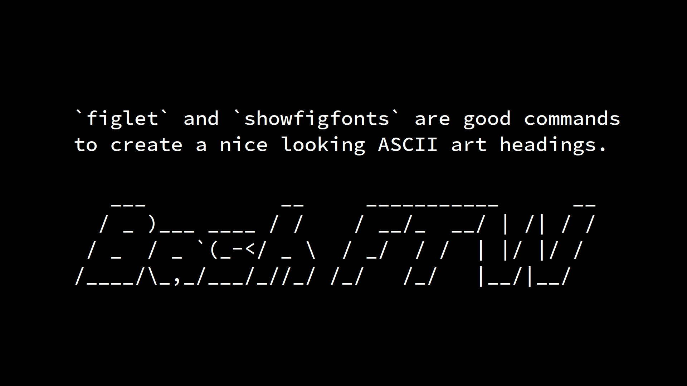

# Bash Slides

This is a simple script written in Bash for slide presentations in terminal.

It is inspired by https://github.com/fxn/tkn.

**It requires terminal which supports 256 colors and formatting.** 
`xterm-256color` should do fine.


## Installation

Clone the repository. 

Required dependencies:
* Bash 4.x + typical GNU utils (tput, head, tail, sed, date, etc.)
* highlight (for code highlighting)

Optional dependencies:
* unclutter (for hiding mouse cursor during presentation)
* Imagemagick (for export to PDF)
* FontAwesome (for nice icons in text)

On Fedora, just run the following:
```
# dnf install highlight unclutter ImageMagick fontawesome-fonts
```

## Usage

Run the following for example slides:

```
$ ./slides
```

The example slides is a showcase of capabilities and contains slide about controls. 
You can also open generated PDF of the example slides.

For running your own slides, use the following:

```
$ ./slides my-directory-with-slides
```

## Tips

* Enlarge your font as much as you can, `slides` will warn you if it will not fit.
* When playing with font size, you can use `R` key to reload slides.
* When printing slides to PDF, use your terminal in full screen with the biggest font


## Testing

Tested on Fedora 25 in `xfce4-terminal`.


## Example presentation

















